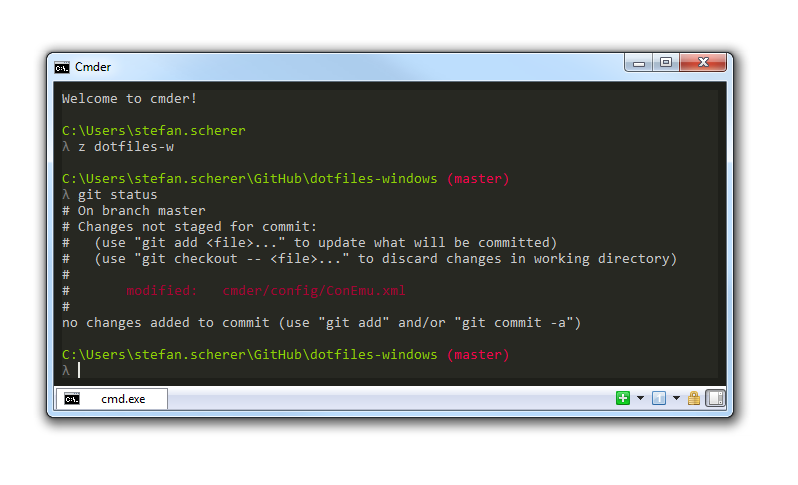

# dotfiles-windows

Add some tweaks into current Windows user's home directory.
Inspired by <https://github.com/paulirish/dotfiles> for MacOS.
For Unix I prefer my <https://github.com/StefanScherer/dotfiles>.

Get even more features with [cmder](http://bliker.github.io/cmder/)! A git prompt will be added.



## Features
### Cmder

The most visible boost is using Cmder as shell enhancement on Windows. See Installation for further steps.

#### Key bindings

* `CTRL + +` - increase font size
* `CTRL + -` - decrease font size

### Syntax highlighting

* gvim highlights inline shell scripts in Vagrantfiles

### Tools

* **addtime**: show relative time stamp in stdout of another tool.
  Usage: anothertool | addtime
* **timeref**: show relative time diffs in logfile.
  Usage: timeref logfile | gvim -
* **viewpath**: show PATH environemnt in gvim pretty printed
* **vagrant-vmware-shell**: open elevated cmd shell for Vagrant with VMware Workstation
* **z**: change to one of your favorite project folder

### Aliases

* **n**: notepad
* **e**: open explorer in current dir
* **..**: one dir up
* **...**: two dirs up
* **....**: three dirs up
* **.....**: four dirs up
* **~**: go into users home directory
* **hosts**: edit your hosts file, if sudo is missing, call `cinst sudo`
* **logvi logfile**: view a log file with relative times in gvim
* **subl**: open Sublime Text 3

### Atom

My preferences for Atom.io are also stored here.

* **autocomplete-plus** - `keymap.cson` use ENTER instead of TAB
* **editorconfig**
* **language-batch**
* **language-powershell**

To setup Atom from scratch, first install it, then
```cmd
cinst atom
apm install parcel
```
Then open Atom and use menu `Packages / Parcel / Sync` to install all other plugins.
**Notice** Sometimes you have to Sync more than once to install all packages.

### Sublime Text 3

* My user preferences for Sublime Text 3 are stored in this repo. Take care. Use **subl** to open editor.
* To install it, I use `cinst SublimeText3`
* Install Package Control, see [Package Control Installation](https://sublime.wbond.net/installation)

* **alt+m** - open Markdown HTML preview in browser

### Vagrant

* default Vagrantfile for global settings. **Beware** save your previous Vagrantfile before calling sync -f

### VIM

* Vundle
* nerdtree - use **Ctrl-N** to toggle directory browser
* vim-nerdtree-tabs
* vim-colors-solarized
* vim-fontzoom - use **+** and **-** to change font size

# Installation
```
git clone https://github.com/StefanScherer/dotfiles-windows && cd dotfiles-windows && sync.bat
```

To update later on, just run the sync again.

```
cinst cmder
```

Close current shell and open a new one. Then cmder will do its magic.

# Git-less installation
Open up a command prompt and enter the following command to install basic tools: DotNet4, Chocolatey and
useful command line tools.

    @powershell -NoProfile -ExecutionPolicy unrestricted -Command "((new-object net.webclient).DownloadFile('https://raw.github.com/StefanScherer/dotfiles-windows/install/install.bat', '%Temp%\install.bat'))" && %Temp%\install.bat

# Licensing
Copyright (c) 2014 Stefan Scherer

MIT License, see LICENSE.txt for more details.
